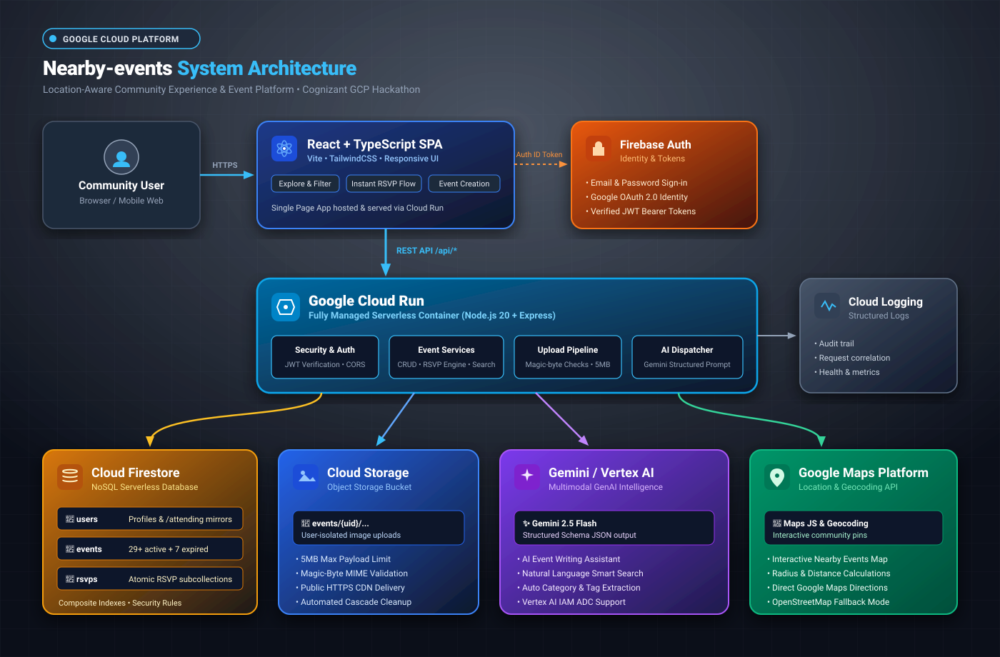

# Nearby-Events 📍
> **Cognizant GCP Hackathon — Use Case 5: Local Event Bulletin Board**  
> *A high-performance, real-time, AI-assisted community event platform built on Google Cloud Platform and Firebase.*

[](https://cloud.google.com)
[](https://react.dev)
[](https://opensource.org/licenses/MIT)

---

## 📌 Overview

**Nearby-Events** is a cloud-native digital community bulletin board designed to help local residents discover, post, share, and RSVP to neighborhood events, garage sales, sports games, and meetups. 

Powered by **Google Cloud Run**, **Cloud Firestore**, **Cloud Storage**, and **Gemini 1.5 Flash**, it solves the fragmentation and clutter of physical bulletin boards and generic social feeds.

---

## 🚀 Key Features (Use Case 5 Requirements)

- 🗂️ **Grid Board Layout**: Clean, modern card grid showing all upcoming community gatherings.
- ⏱️ **Automatic Date Sorting**: Events happening next appear first at the top-left using compound indexed Firestore queries (`date ASC, time ASC`).
- 🧹 **Automatic Expiration Logic**: Past events older than today are automatically flagged/hidden from active feeds and viewable in a dedicated past events archive.
- 👍 **"I'm Going" RSVP Counter**: 1-click attendance button on every event card with live optimistic count updates and duplicate prevention.
- 🏷️ **Color-Coded Category Badges**: Visual tags for **Sports**, **Music**, **Food**, **Yard Sale**, **Technology**, **Education**, and **Community**.
- 📍 **Neighborhood Search & Interactive Map**: Filter events instantly by neighborhood name, city, or browse via interactive Leaflet/Google Maps view with custom category pins.
- 🔗 **Shareable Deep Links**: Direct URL per event (`/events/:id`) with 1-click clipboard copy and native mobile Web Share API support.
- 🤖 **Gemini 1.5 AI Event Assistant**: Generates engaging titles, rich descriptions, and smart tags from a simple 1-line note.

---

## 🏛️ System Architecture



| Component | Google Cloud Service | Purpose |
|---|---|---|
| **Compute** | **Google Cloud Run** | Scalable, containerized Node.js/TypeScript backend API. |
| **Database** | **Cloud Firestore** | Real-time NoSQL document database for Events, RSVPs, and Users. |
| **Storage** | **Google Cloud Storage** | Secure, CDN-cached bucket for event cover photos and media. |
| **Generative AI** | **Vertex AI / Gemini 1.5** | AI Event Assistant for description and tag auto-generation. |
| **Authentication** | **Firebase Auth** | User authentication with secure JWT tokens and role management. |
| **Logging & Monitoring** | **Google Cloud Logging** | Structured JSON logging with request tracing. |

For detailed architectural specifications, see [docs/architecture-diagram.md](docs/architecture-diagram.md) and [docs/gcp-architecture.md](docs/gcp-architecture.md).

---

## 📂 Project Structure

```
Nearby-Events/
├── backend/                  # Express + TypeScript API Server (Cloud Run)
│   ├── src/
│   │   ├── config/           # Firebase, GCP, and environment config
│   │   ├── middleware/       # Auth, error handling, rate limiting
│   │   ├── routes/           # REST endpoints (/events, /rsvps, /ai, /uploads)
│   │   ├── services/         # Business logic (event, rsvp, ai, storage)
│   │   └── index.ts          # Server entry point
│   ├── package.json
│   └── tsconfig.json
├── frontend/                 # React 18 + Vite + Tailwind CSS + Leaflet
│   ├── src/
│   │   ├── components/       # EventCard, EventMap, EventFilters, EventForm
│   │   ├── context/          # Auth context and state providers
│   │   ├── pages/            # Home, Explore, EventDetails, CreateEvent, etc.
│   │   └── App.tsx           # Router and application root
│   ├── package.json
│   └── vite.config.ts
├── scripts/
│   └── seed-events.ts        # 36 realistic demo events (upcoming & expired)
├── docs/                     # Hackathon documentation & diagrams
│   ├── cognizant-hackathon-report.md  # 5-page submission report
│   ├── presentation-slides.md         # 10-slide ready presentation deck
│   ├── architecture-diagram.md        # Architecture specification
│   ├── architecture-diagram.svg       # Presentation-ready SVG diagram
│   ├── gcp-deployment.md              # Cloud Run & GCP deployment guide
│   ├── demo-script.md                 # Live presentation demo walkthrough
│   └── security.md                    # Security audit & threat modeling
├── docker/                   # Dockerfile & Docker Compose configs
├── firestore.rules           # Security rules for Cloud Firestore
├── firestore.indexes.json    # Composite indexes for compound sorting
└── package.json              # Monorepo root scripts
```

---

## 🛠️ Quick Start & Running Locally

### Prerequisites
- Node.js 18+ & npm
- Firebase CLI (optional for emulators)

### 1. Clone the repository
```bash
git clone https://github.com/kanishmanickam/Nearby-Events.git
cd Nearby-Events
```

### 2. Install all dependencies
```bash
npm run install:all
```

### 3. Seed Realistic Demo Data (36 Events)
```bash
npm run seed          # add/refresh the demo events
npm run seed:clear    # remove previously seeded events first
```

### 4. Start Development Servers
In two separate terminals:
```bash
# Terminal 1: Backend API (Port 8080 — the Vite dev server proxies /api here)
npm run dev:api

# Terminal 2: Frontend Web App (Port 5173)
npm run dev:web
```

Visit `http://localhost:5173` in your browser!

---

## 📊 Breadth of Sample Data

The platform comes with a pre-configured seed generator in `scripts/seed-events.ts` providing **36 realistic community events**:
- **Sports**: Pickup soccer, 3v3 basketball, sunset yoga, 5K fun run.
- **Music**: Jazz in the park, acoustic open mic, indie indie showcase.
- **Food**: Taco crawl, farmers market brunch, artisan sourdough workshop.
- **Yard Sale**: Multi-family estate sale, neighborhood book exchange, vintage vinyl swap.
- **Technology**: Local AI hack night, robotics demo, web dev meetup.
- **Education**: Urban gardening 101, local history walking tour.
- **Community**: Park cleanup drive, neighborhood association townhall.
- **Expired Events**: Dedicated dataset to verify automatic expiration handling.

---

## 🏆 Hackathon Submission Documents

| Document | Description | Link |
|---|---|---|
| **Submission Report** | Full 5-page project report addressing problem, data, KPIs, and GCP architecture | [docs/cognizant-hackathon-report.md](docs/cognizant-hackathon-report.md) |
| **Presentation Deck** | 10-slide comprehensive presentation deck | [docs/presentation-slides.md](docs/presentation-slides.md) |
| **Architecture Diagram** | Visual SVG schematic of the GCP stack | [docs/architecture-diagram.svg](docs/architecture-diagram.svg) |
| **Demo Script** | Step-by-step evaluator testing journey | [docs/demo-script.md](docs/demo-script.md) |
| **GCP Deployment Guide** | Step-by-step Cloud Run deployment commands | [docs/gcp-deployment.md](docs/gcp-deployment.md) |

---

## 📄 License
This project is licensed under the MIT License - see the LICENSE file for details.
