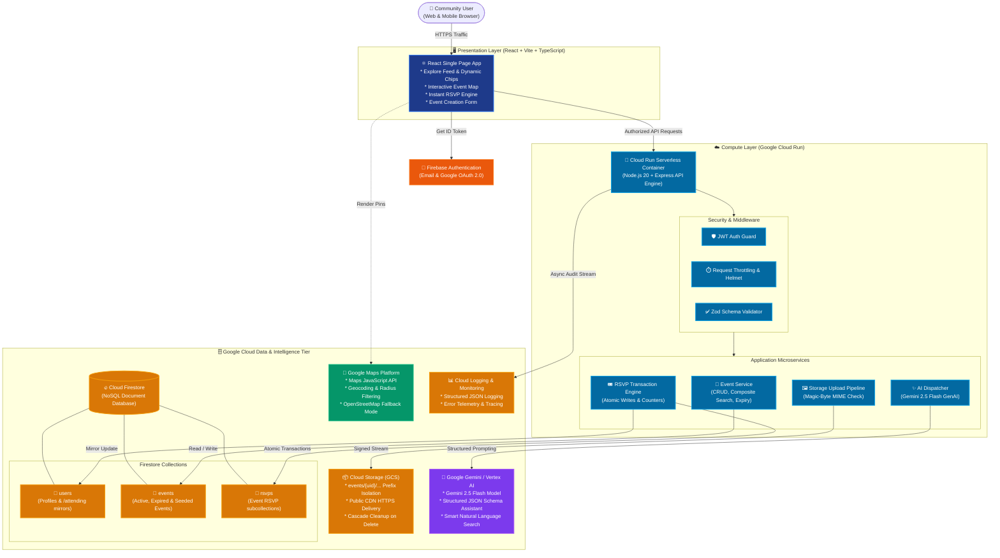

# Nearby-events System Architecture Diagram

> **Cognizant Google Cloud Hackathon Project**  
> *Discover. Connect. Participate. — A Location-Aware Community Event & Experience Platform*

---

## 1. High-Level Architecture Flow

```
                                  +-----------------------+
                                  |         USER          |
                                  |  (Browser / Mobile)   |
                                  +-----------+-----------+
                                              |
                                              | HTTPS / Web
                                              v
                                  +-----------------------+           +-----------------------+
                                  |  React + TypeScript   | --------> | Firebase Auth Service |
                                  |     Vite Frontend     | <-------- |  (Google / Email JWT) |
                                  +-----------+-----------+           +-----------------------+
                                              |
                                              | REST API (/api/*) + JWT Bearer
                                              v
                                  +-----------------------+           +-----------------------+
                                  |    Google Cloud Run   | --------> |     Cloud Logging     |
                                  |  (Express API Engine) |           |  (Audit & Telemetry)  |
                                  +-----------+-----------+           +-----------------------+
                                              |
            +---------------------------------+---------------------------------+
            |                                 |                                 |
            v                                 v                                 v
+-----------------------+         +-----------------------+         +-----------------------+
|    Cloud Firestore    |         |     Cloud Storage     |         |   Gemini / Vertex AI  |
|  (Serverless NoSQL)   |         |    (Images Bucket)    |         |   (GenAI Assistant)   |
|                       |         |                       |         |                       |
|  * users/             |         |  * events/{uid}/*     |         |  * Structured JSON    |
|  * events/            |         |  * Magic-byte Check   |         |  * Event Assistant    |
|  * rsvps/             |         |  * 5 MB Max Upload    |         |  * Smart Search       |
+-----------------------+         +-----------------------+         +-----------------------+
            |
            +---------------------------------+
                                              |
                                              v
                                  +-----------------------+
                                  |  Google Maps Platform |
                                  | (Location & Geocoding)|
                                  |                       |
                                  |  * Interactive Pins   |
                                  |  * Distance Radius    |
                                  |  * Venue Navigation   |
                                  +-----------------------+
```

---

## 2. Interactive Mermaid Diagram



---

## 3. Google Cloud Component Breakdown

| GCP Component | Role in Nearby-events | Key Architectural Feature |
|---|---|---|
| **Google Cloud Run** | Serverless Backend & SPA Host | Autoscaling 0 to N instances, sub-second boot, single container deployment. |
| **Cloud Firestore** | Primary NoSQL Document Database | Atomic transactions for RSVPs, composite indexes for rapid filtering, subcollections for scalability. |
| **Cloud Storage (GCS)** | Event Imagery Object Store | User-isolated prefixes (`events/{uid}/...`), magic-byte validation, 5MB ceiling. |
| **Gemini / Vertex AI** | Generative AI & Semantic Assistant | `@google/genai` structured JSON schema generation for event drafts and smart search intent. |
| **Google Maps Platform** | Location & Neighborhood Visualization | Map pin rendering, distance calculation (Haversine formula), directions navigation. |
| **Firebase Auth** | Identity & Access Management | Google Sign-in and Email/Password with JWT validation via Firebase Admin SDK. |
| **Cloud Logging** | Observability & Audit Trail | Structured JSON logs with request correlation IDs and health check monitoring. |

---

## 4. Presentation Graphic Asset

A vector SVG diagram is available for slide decks and submission materials:

👉 **[Download / View Presentation SVG (`docs/architecture-diagram.svg`)](file:///c:/Users/kanis/OneDrive/Desktop/Cognizant%20hackhathon/Hackhathon/docs/architecture-diagram.svg)**

---

## 5. Security & Isolation Model

```
+--------------------------------------------------------------------------+
|                            SECURITY BOUNDARIES                           |
+--------------------------------------------------------------------------+
| 1. Client Security:                                                      |
|    - No secrets in frontend bundle (VITE_ variables are public only).    |
|    - All sensitive writes require Authorization Bearer <Firebase ID Token>|
|                                                                          |
| 2. API Security:                                                         |
|    - Magic-byte image inspection prevents malicious file uploads.        |
|    - Ownership verification ensures creators only edit/delete own data.  |
|    - HTML output sanitization and https:// URL enforcement for images.   |
|                                                                          |
| 3. Data Consistency:                                                     |
|    - RSVP count is protected by server-side Firestore Transactions.      |
|    - Cascading delete cleans event documents, RSVPs, and GCS images.     |
+--------------------------------------------------------------------------+
```
