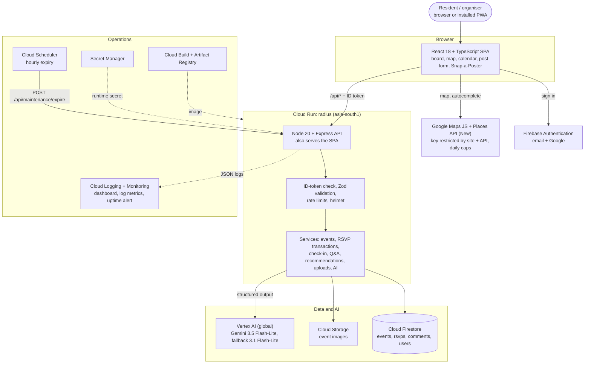

# Radius — System Architecture Diagram

> As deployed on Google Cloud (project `radius-510418`, region `asia-south1`).
> Live: https://radius-x2gneiue7a-el.a.run.app · Vector version for slides: [`architecture-diagram.svg`](architecture-diagram.svg)

---

## 1. High-level flow

```
                        +--------------------------+
                        |   Resident / organiser   |
                        |  (browser, installable)  |
                        +------------+-------------+
                                     | HTTPS
                                     v
 +-------------------+     +--------------------------+     +-----------------------------+
 |  Firebase Auth    |<--->|  React + TypeScript SPA  |---->| Google Maps JS + Places (New)|
 | email / Google    |     |  (served by Cloud Run)   |     | key locked to our site      |
 +-------------------+     +------------+-------------+     +-----------------------------+
          ID token  ------------------> | REST /api/*  (Bearer ID token)
                                        v
                        +--------------------------------+        +----------------------+
 Cloud Scheduler ------>|  Cloud Run  "radius"    |------->|  Cloud Logging       |
 hourly: POST           |  Node 20 + Express, 0-10 inst. |        |  + Monitoring        |
 /api/maintenance/expire|  helmet, Zod, rate limits      |        |  dashboard, uptime,  |
                        +---+------------+------------+--+        |  log metrics, alert  |
                            |            |            |           +----------------------+
                            v            v            v
               +-------------+  +-------------+  +------------------------------+
               |  Firestore  |  |   Cloud     |  |  Vertex AI (global)          |
               |  (Native)   |  |   Storage   |  |  Gemini 3.5 Flash-Lite       |
               |  events     |  |  event      |  |  fallback 3.1 Flash-Lite     |
               |   /rsvps    |  |  images     |  |  -> built-in rules           |
               |   /comments |  +-------------+  +------------------------------+
               |  users      |
               |   /attending, /saved            Secret Manager: maintenance token
               +-------------+

 Build: scripts/deploy.ps1 -> Cloud Build -> Artifact Registry -> Cloud Run
 Outside GCP, no key: Open-Meteo (event-day weather), OpenStreetMap (fallback map, geocoding, suggestions)
```

---

## 2. Mermaid diagram



---

## 3. Components

| Component | Role | Notes |
|---|---|---|
| **Cloud Run** | API + serves the app | One container, scales 0–10, `TZ=Asia/Kolkata`, startup CPU boost |
| **Cloud Firestore** | Events, RSVPs, Q&A, profiles | RSVP counts change only inside transactions; rules deny client writes to counts/status/owner and deny direct reads of events (check-in codes) |
| **Cloud Storage** | Event images | Per-user paths `events/{uid}/…`, type checked from file bytes, 5 MB cap |
| **Vertex AI** | Snap-a-Poster, AI assist, AI search | Service-account auth, no key; 12 s timeout, one retry on the fallback model, then built-in rules (not for Snap-a-Poster) |
| **Firebase Auth** | Sign-in | Email/password and Google; the API verifies ID tokens |
| **Google Maps Platform** | Map, Places autocomplete | Key restricted to our URLs and to Maps JS / Places / Place widgets; daily quota caps |
| **Cloud Scheduler** | Expiry | Hourly call with a secret header marks ended events `EXPIRED` |
| **Secret Manager** | Secrets | Injected at runtime, never in the image or build args |
| **Cloud Logging + Monitoring** | Observability | Dashboard, 7 log-based metrics, uptime check on `/api/health` with email alert — see [`monitoring/`](../monitoring/README.md) |
| **Cloud Build + Artifact Registry** | Delivery | `scripts/deploy.ps1` → build → push → deploy (~5 min) |

---

## 4. Security boundaries

```
1. Browser:  only public values in the bundle (Firebase web config, site-restricted Maps key).
             Every write sends a Firebase ID token.
2. API:      verifies the token; only the organiser edits/deletes; Zod on every input;
             rate limits (240 reads / 40 writes per minute per IP, 12 AI calls per minute per user);
             image type from magic bytes; check-in code returned only to the organiser.
3. Database: Firestore rules as a second line: no client reads of events, no client writes to
             rsvpCount / status / creatorId, RSVP id = caller's uid (no duplicates).
4. Cloud:    secrets in Secret Manager; AI via service account; budget alert; Maps quota caps.
```
